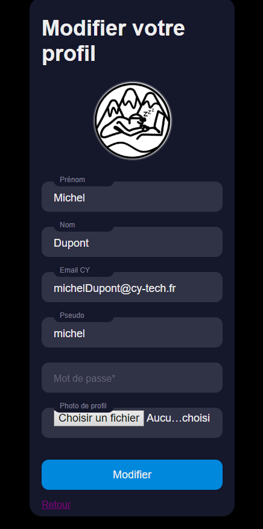
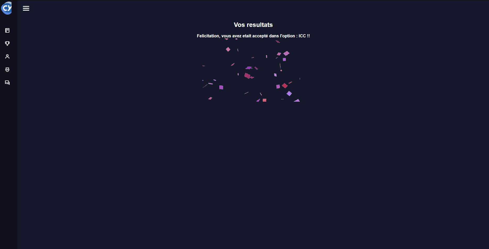

# CY Parcours

---

Auteurs : Quentin Ducoulombier, Furger Achille, Lucas Thu Ping One, Noé Faucher  
Date: 2 Juin 2022  
Email: ducoulombi@cy-tech.fr, furgerachi@cy-tech.fr, thupingone@cy-tech.fr, fauchernoe@cy-tech.fr

---
## Présentation

Au cours de la deuxieme année du cycle ingénieur à CY Tech, les étudiants préparent leur année suivante en choisissant l’option de leur rêve pour leur dernière année.  
Chaque option possède cependant un nombre limité de places, elles ne peuvent pas systématiquement accueillir tous les étudiants souhaitant la rejoindre. Aussi, certains étudiants souhaitent faire une option particulière mais n’ont malheureusement pas les résultats suffisants pour pouvoir réussir dans de bonnes conditions. Dès lors, il a été défini des critères de mérite permettant de classer les étudiants sur un vœu d’option. Chaque étudiant devra alors classer les options disponibles au bout de son parcours par ordre de préférence.  
C'est en répondant a cette problématique qu'a été créé **CY Parcours**, ce site web utilise un algorithme plaçant les étudiants dans chaque option en harmonisant selon les choix, tout en respectant les critères de mérite de l’option. Pour cela, **CY Parcours** utilise notamment [l’algorithme des “mariages stables”](https://fr.wikipedia.org/wiki/Algorithme_de_Gale_et_Shapley). Ce site bénificie également d'une interface facile d'utilisation pour tous les types d'utilisateurs (étudiants, responsables administratifs ou encore administrateurs).

Exemple de menu:  
<p>



</p>

## Mise en place du serveur

Lancer le serveur dans le dossier `projet-devweb-main` (pour linux):
```bash
    php -S localhost:8080
```
Pour windows, installer `wsl` et installer un OS linux sur wsl puis suivre les mêmes instructions que pour la mise en place du serveur sous linux ou suivre ce [tuto](https://openclassrooms.com/fr/courses/918836-concevez-votre-site-web-avec-php-et-mysql/4237816-preparez-votre-environnement-de-travail#/id/r-4443612).


Puis mettre dans l'url le lien suivant :
```
localhost:8080/code/connexion.php 
```

## Utilisation du site
  
Vous pouvez ensuite créer un compte administrateur pour créer les identifiants des élèves, ou un compte responsable admission.
Les logins des élèves avec les mots de passe non encryptés seront dans le fichier "loginElevesMail.csv".
Une fois le(s) compte(s) créé(s) vous pouvez vous connecter, et utiliser les fonctionnalités uniques pour chaque type d'utilisateur :

- Pour les admins : générer les logins des élèves, afficher l'historique des changements d'options effectués par les responsables admission.

- Pour les responsables admission : envoyer des tickets à l'administrateur, lancer le mariage stable, changer les filières des étudiants une fois le mariage stable effectué ou encore afficher les statistiques de chaque option.

- Pour les élèves : on peut également envoyer des tickets, afficher les résultats, afficher la moyenne et les voeux de l'étudiant. De plus, une fois le mariage stable effectué et validé, l'étudiant peut consulter sa future option.

On retrouve également des fonctionnalités communes à tous les types d'utilisateurs, comme envoyer des messages ou modifier son profil.
